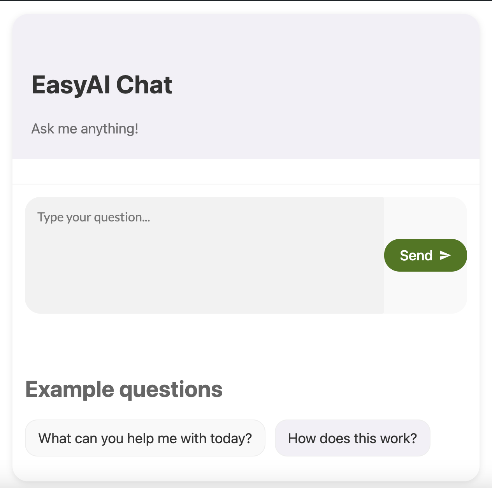
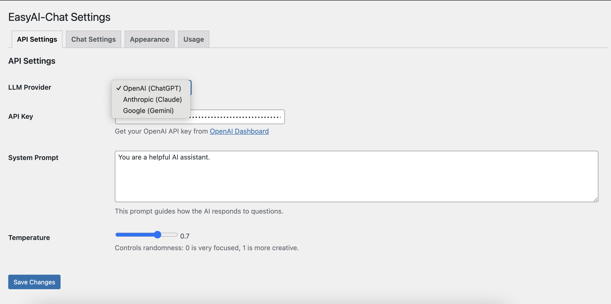
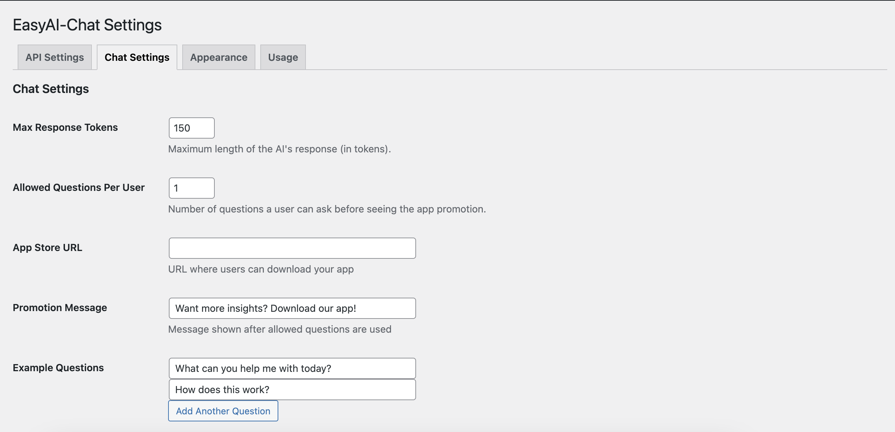
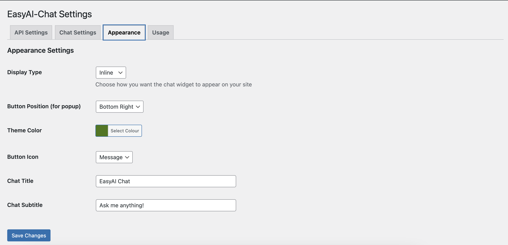

🎯💬 # EasyAI-Chat

## A WordPress AI Chat Plugin with Multi-Model Support

🚀 **EasyAI-Chat** enables AI-powered conversations on your WordPress website using **ChatGPT (OpenAI), Claude (Anthropic), and Gemini (Google)**. Easily integrate intelligent chat functionality to engage visitors, provide support, or answer user queries in real-time.

---

## ✨ Features

- **Multiple AI Providers** – Seamlessly switch between OpenAI’s **ChatGPT**, Anthropic’s **Claude**, and Google’s **Gemini**
- **Custom System Prompts** – Control AI responses for a tailored experience
- **Flexible Display Options** – Use an **inline chat** or a **floating popup button**
- **User Interaction Limits** – Set a maximum number of free queries before prompting users to download your app
- **Easy Shortcode Integration** – Add AI chat anywhere with `[easyai_chat]`
- **Customizable UI** – Adjust chat colours, button positioning, and styling to match your brand
- **Boosts Engagement** – Encourages users to interact and explore your app for extended features  

> **Perfect for customer support, expert Q&A, and interactive AI-powered engagement!**

---

## 📥 Installation

### 1️⃣ Upload the plugin
- Extract and upload the `easyai-chat` folder to `/wp-content/plugins/`.

### 2️⃣ Activate the plugin
- Go to **WordPress Dashboard → Plugins** and activate **EasyAI-Chat**.

### 3️⃣ Configure API Keys
- Navigate to **Settings → EasyAI-Chat** and enter your API keys:
  - **OpenAI**: [Get API Key](https://platform.openai.com/api-keys)
  - **Anthropic**: [Get API Key](https://console.anthropic.com/)
  - **Google AI**: [Get API Key](https://makersuite.google.com/app/apikey)

### 4️⃣ Add to Your Site

#### Using a shortcode:
```html
[easyai_chat]
```
Or add it to your theme files using PHP:
```html
<?php echo do_shortcode('[easyai_chat]'); ?>
```

## ❓ Frequently Asked Questions

### 1️⃣ Which AI providers are supported?
Currently, **EasyAI-Chat** supports:  
- **OpenAI (ChatGPT)**  
- **Anthropic (Claude)**  
- **Google AI (Gemini)**  

### 2️⃣ Do I need to provide API keys?
Yes, you must enter your API keys from the supported providers.

### 3️⃣ How can I customize the chat appearance?
You can modify the **chat button colour, position, and other styles** in the **EasyAI-Chat settings**.

### 4️⃣ Can I limit how many questions users can ask?
Yes, you can set a **maximum number of free queries**, after which users will see a **custom app promotion**.

### 5️⃣ Where does the chat appear on my site?
You can choose between:  
- **Inline Chat** – Appears wherever you place the shortcode  
- **Floating Popup Chat** – Visible on all pages  

---

## 🖼 Screenshots

1. **Frontend Chat Interface**  

2. **Admin Panel – API Configuration**


4. **Admin Panel – Customization Options**  


6. **Floating Chat Button in Action**  



---

## 📌 Changelog

### 🆕 Version 1.0.0
✔️ Initial release of **EasyAI-Chat**  

---

## 🚀 Development & Contributions

💡 **EasyAI-Chat** is designed for **customization and extensibility**. Developers can modify and extend the plugin as needed.  

🔗 **GitHub Repository**: [Your GitHub Repository](#)  

📬 **Have suggestions or issues?** Feel free to open a **pull request** or submit an **issue** on GitHub!  
